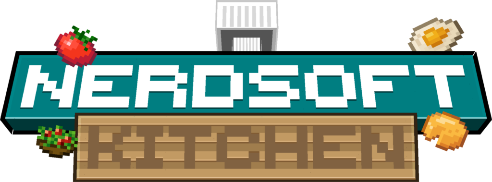
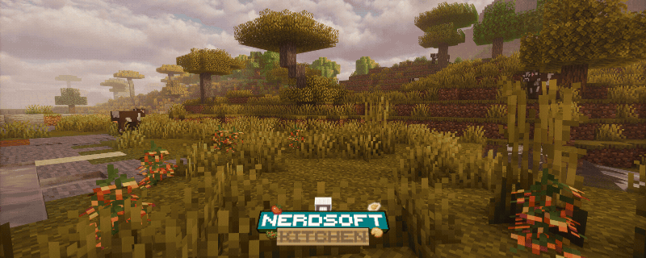
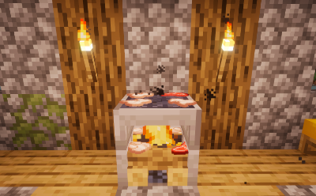
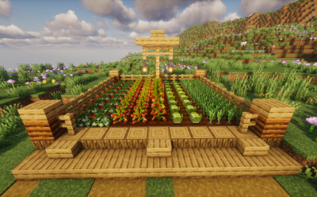

<b> A cooking overhaul for NeoForge 1.21.1 </b>
<b> New crops, a multi-slot grill table and fillable vessels. </b>

---

## Overview

**NerdSoft Kitchen** adds a small but deep cooking loop to Minecraft: grow your own produce, work a hand-fed **Grill
Table**, and fill a reusable **Iron Cup** with milk, yogurt, or strawberry yogurt. Everything is built data-driven on
top of vanilla systems (custom recipe types, data components, and datagen for recipes/loot/tags/advancements/language),
so the mod stays lightweight and easy to extend or add compatibility for.

> Currently in **Beta 0.1** — core systems are implemented and stable, but content, balance, and polish are still
> evolving. Feedback and bug reports are very welcome.

## Features

### 🔥 The Grill Table

- An 8-slot cooking block: 4 dedicated **grill slots** driven by a custom cook recipe type, plus 4 **campfire slots**
  that reuse vanilla campfire recipes — cook two different ways on the same block.
- **Regular** and **Soul** variants — the Soul Grill Table burns with a bonus cooking-speed multiplier.
- Place a hay bale nearby for a cooking-speed boost.
- Directional placement, waterloggable, ignites from lava, and lights up when active.
- Custom block entity renderer with animated food items, sizzle particles, and looping grill audio for full sensory
  feedback.

### 🌱 Crops

- **Strawberry**, **Tomato**, **Lettuce**, and **Purple Onion** — each with dedicated seeds, block states, and growth
  stages.
- Tomatoes grow on a **trellis/pole** mechanic for a more realistic garden layout.
- **Wild variants** of every crop can be found generating naturally in the world, harvested for a small snack or to
  kickstart your first farm — no starter seeds required.

### 🥛 The Iron Cup

- A reusable, refillable vessel instead of a single-use container.
- Fill it with **milk** straight from a cow, then turn it into **yogurt** or **strawberry yogurt** through dedicated
  curdle/mix recipes.
- Content is tracked via a proper data component, so each fill state has its own name, food values, and model — and JEI
  treats each as a distinct entry automatically.

### 🍳 New Foods & Recipes

- Raw & cooked chicken pieces, fried egg, salad, milk, yogurt, and strawberry yogurt.
- Custom recipe types: grill cooking, curdling, mixing, and shapeless cup crafting (with a dedicated ingredient type for
  cup contents).
- A full data-driven backend: recipes, loot tables, item/block tags, advancements, biome/placed features for crop
  world-gen, and sound definitions are all generated, not hand-authored per platform.

### 🌍 Built-in Localization

- Ships with **English (en_us)** and **Spanish (es_es)** translations out of the box.

## Installation & Requirements

| Requirement | Version                                        |
|-------------|------------------------------------------------|
| Minecraft   | `1.21.1`                                       |
| Mod Loader  | [NeoForge](https://neoforged.net/) `21.1.235+` |
| Java        | `21+`                                          |

1. Install [NeoForge](https://neoforged.net/) for Minecraft 1.21.1.
2. Download the latest **NerdSoft Kitchen** jar from [Modrinth](https://modrinth.com/mod/nerdsoftkitchen)
   or [CurseForge](https://www.curseforge.com/minecraft/mc-mods/nerdsoftkitchen).
3. Drop the jar into your `mods/` folder.
4. (Optional) Install [JEI](https://www.curseforge.com/minecraft/mc-mods/jei)
   and/or [Jade](https://modrinth.com/mod/jade) for the integrations described below.
5. Launch the game.

> This mod is a **client + server** mod — install it on both sides for multiplayer.

## Configuration & Integration

### JEI (Just Enough Items)

Optional, client-side. When installed, NerdSoft Kitchen registers:

- A dedicated **Grill Cooking** recipe category showing every custom grill recipe alongside its required catalyst.
- Subtype support for the Iron Cup, so each fill state (empty, milk, yogurt, strawberry yogurt) shows up and searches as
  its own distinct item.

### Jade

Optional, client-side. When installed, hovering over an active **Grill Table** shows an interactive tooltip with the
items currently cooking inside it — no need to open a GUI to check progress.

### Data Components

Iron Cup contents are implemented as a first-class [data component](https://docs.neoforged.net/), not NBT or metadata —
this keeps stacking, tooltips, and JEI/Jade integration consistent and future-proof against further additions.

No config file is required for Beta 0.1; all tuning currently lives in the datapack (recipes, loot tables, tags).

## Screenshots

 
 
 

## Contribution Guidelines

Contributions are welcome for **bug reports, translations, and datapack-side content** (recipes, loot tables, tags).
Please note the source license below before submitting code.

1. **Bugs & suggestions:** open a [GitHub Issue](https://github.com/nerdsoft-mods/nerdsoftkitchen/issues) with your
   Minecraft/NeoForge/mod version, a log if relevant, and steps to reproduce.
2. **Pull requests:** open an issue first to discuss the change before investing time in a PR — this project does not
   currently accept unsolicited code contributions without prior discussion (see [License](#license)).
3. **Translations:** language files live under `src/main/java/.../datagen/ModEnUsLanguageProvider.java` and
   `ModEsEsLanguageProvider.java` (datagen-based, not raw JSON) — open an issue to propose or contribute a new language.
4. **Dev environment:** standard NeoForge Gradle userdev setup — `./gradlew runClient` / `./gradlew runData` to
   regenerate assets.

Please be respectful and constructive — see our [Code of Conduct](CODE_OF_CONDUCT.md) placeholder.

## License

**All Rights Reserved.**

This repository is source-available for transparency and community bug reports, but is **not** licensed for
redistribution, reuse, or derivative works without explicit permission from the authors. See [`LICENSE`](LICENSE) for
full terms, or open an issue if you'd like to discuss usage permissions.

---

Made with 🍳 by **Bichal** and **Hugo**

[Modrinth](https://modrinth.com/mod/nerdsoftkitchen) · [CurseForge](https://www.curseforge.com/minecraft/mc-mods/nerdsoftkitchen) · [Discord](https://discord.gg/your-invite) · [Issues](https://github.com/nerdsoft-mods/nerdsoftkitchen/issues)

